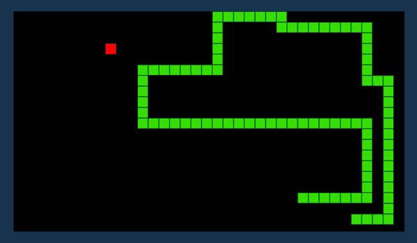

---
author:
- Ernesto Melchor
date: August 2020
title: 'Snake: The Game'
---

[\[fig:snake\]]{#fig:snake label="fig:snake"}

Background
==========

Snake is the name of a video game concept where the player maneuvers a
line which grows in length every time it consumes food. In the game, the
line and the board boundaries are the primary obstacles. The concept
originated in the 1976 arcade game Blockade, and the ease of
implementing Snake has led to hundreds of versions (some of which have
the word snake or worm in the title) for many platforms.

The Project
===========

In this project we will implement a version of Snake: The Game and a
variation of the game that allows for competition. A common approach for
designing the game takes an object oriented approach using nested
arrays. To make our design more interesting we will not use Python lists
to store our data, instead we will use a variation of Linked Lists that
we will call Tiles. Before we build up to designing the board where the
game will be played we first need to talk about how to create tiles.

The Tile Class and Variations
=============================

In the snake game there are 5 different types of tiles:

1.  The head tile: a tile representing the head of the snake. A head
    tile at time step $t$ will be denoted by $H_{i,j}^{(t)}$ where
    $(i, j)$ are the row and column locations of the tile in the grid.

2.  The tail tile: a tile representing the tail of the snake. A tail
    tile at time step $t$ will be denoted by $T_{i,j}^{(t)}$ where
    $(i, j)$ are the row and column locations of the tile in the grid.

3.  The body tile: a tile representing a portion of the snake that is
    neither a tail nor a head. A body tile at time step $t$ will be
    denoted by $B_{i,j}^{(t)}$ where $(i, j)$ are the row and column
    locations of the tile in the grid.

4.  The food tile: a tile representing the food that the snake eats. A
    food tile at time step $t$ will be denoted by $F_{i,j}^{(t)}$ where
    $(i, j)$ are the row and column locations of the tile in the grid.

5.  The empty tile: a tile representing an empty tile. An empty tile at
    time step $t$ will be denoted by $E_{i,j}^{(t)}$ where $(i, j)$ are
    the row and column locations of the tile in the grid.

The Grid Class
==============

The grid class is built from multiple tile instances that are connected
to one another. A tile can either be placed on top, below, to the left,
or to right of another. A grid has also has an immutable grid size and a
board state for every given time step $t$.

Snake: The Rules
================

The rules of the game go as follows:

1.  The head of the snake can move in four directions at any given time:
    up, down, left, or right. The snake's head, however, cannot move
    back to the block in the previous time step $t-1$ unless the snake
    is only one tile long.

2.  If no new input is given then the snake continues to move in that
    direction until a new direction is provided.

3.  If the snake's head encounters a food tile then it eats the food and
    the score goes up by $100$ points.

4.  When the food is eaten the snake grows longer for $\Delta t$ time
    steps.

5.  When food is eaten it is removed from the board and a new location
    for the food is randomly chosen from the empty tiles.

6.  If the snake's head collides with the boundary or any other part of
    the snake (body or tail) then the game ends and the score is
    recorded.

Important Quantities
====================

In the game there are a few quantities you may want to keep track of in
order to win. You must check for 3 tiles in all 8 principal directions
(North, North East, East, South East, South, South West, West, and North
East) starting from the head tile and ending at the tile in question.
Store these values in a 24-item dictionary and make sure they're easily
accessible by your program:

1.  Distance from the head tile to the closest food tile in all 8
    directions.

2.  Distance from the head tile to the closest border in all 8
    directions.

3.  Distance from the head tile to the closest body tile in all 8
    directions.

In case you need a refresher on how to compute the distance between two
things this is the equation: $$\begin{aligned}
    D &= \sqrt{(X_2 - X_1)^2 + (Y_2 - Y_1)^2}\end{aligned}$$

If you are interested we can use these quantities to teach our snake how
to make its own decisions and how to play the game. I must warn you
though that this task is a bit more complicated than what we have done
so far, but I guarantee you that it's worth it. By allowing our snake to
make its own decisions on how to play the game it meets the criteria of
what computer scientist like to call Artificial Intelligence.
